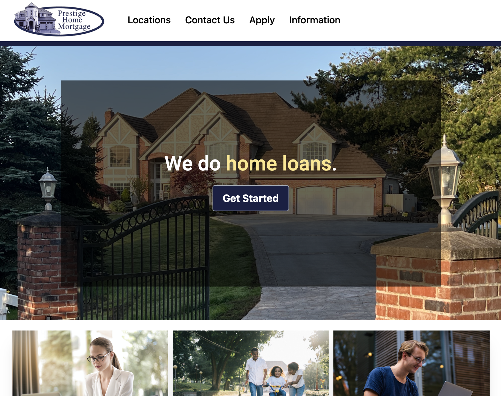

# Company Landing Page Version 0.3

### Written in ReactJS & Tailwind

A clone of the landing page for a  popular ROI for mortgage brokers, fixing window scaling issues and switching images to be legal to use.

## Instructions

1. Download this repo to your computer.
2. Install npm packages by typing 'npm install' in terminal inside the root of the downloaded repo.
3. Type 'npm start' to run a local instance of this with ReactJS.
4. Visit localhost:3000 to see it live.

### Future Goals / Plans

- To create a form that's either sent to broker's email, or sent to a backend portal that multiple mlo's can login to (more closely emulating original)
- Build more pages that use protected wordage (per industry)

#### by probablynotryan
